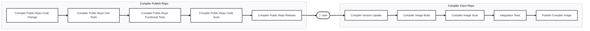

```mermaid
---
config:
  theme: redux
  layout: dagre
---
flowchart LR
    subgraph compiler_public["Compiler Publish Repo"]
        compiler_public_repo["Compiler Public Repo Code Change"]
        compiler_public_repo_ut["Compiler Public Repo Unit Tests"]
        compiler_public_repo_ft["Compiler Public Repo Functional Tests"]
        compiler_public_repo_code_scan["Compiler Public Repo Code Scan"]
        compiler_public_repo_release["Compiler Public Repo Release"]
    end

    compiler_public_repo --> compiler_public_repo_ut
    compiler_public_repo_ut --> compiler_public_repo_ft
    compiler_public_repo_ft --> compiler_public_repo_code_scan
    compiler_public_repo_code_scan --> compiler_public_repo_release

    subgraph compiler_cisco_user["Compiler Cisco Repo"]
        compiler_cisco_repo["Compiler Version Update"]
        compiler_cisco_build_image["Compiler Image Build"]
        compiler_cisco_image_scan["Compiler Image Scan"]
        compiler_cisco_integration_test["Integration Tests"]
        compiler_cisco_publish_image["Publish Compiler Image"]
    end
    compiler_cisco_repo --> compiler_cisco_build_image
    compiler_cisco_build_image --> compiler_cisco_image_scan
    compiler_cisco_image_scan --> compiler_cisco_integration_test
    compiler_cisco_integration_test --> compiler_cisco_publish_image

    compiler_public_repo_release -->  user([👤 User]) -->  compiler_cisco_repo
```