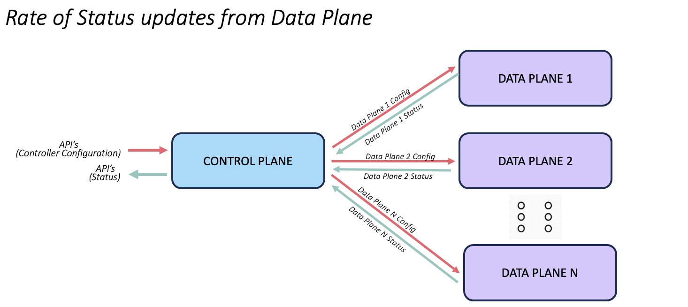

# Nexus Control Plane Framework

Nexus software stack provides framework, toolkit and runtime, that:

* enables development of microservices for Control Plane, with architectural correctness and characteristics
* empowers developers to focus their efforts on their core business logic, by leveraging the nexus framework and runtime to handle the complexities of building and running a Control Plane
* simplifies operational complexity with toolkits, runtime features and guard rails build on best practices of the microservices pattern

## Nexus Framework 

Nexus is a framework in the sense: it enables a development workflow that is model driven and follows API First approach to development.

**But why do we need one more framework ?**

The answer to this ”why” is to do with the microservice design pattern.

Simply put, Nexus framework enables developers to build better microservices. It enables a workflow that is architected with the pragmatic aspects the microservice architecture in mind. 

And this context is very important. So let's double click.

**What is a Microservice Architecture ?**

Microservices - also known as the microservice architecture - is an architectural style that structures an application as a collection of two or more services that are:

* independently deployable
* loosely coupled

Services are typically organized around business capabilities. Each service is often owned by a single, small team.

from [Mircoservices.io](https://microservices.io/)

**Independently deployable**

Independently deployable means a scheme where services of the application are independently deployed and executed. A critical attribute of being an independently deployable service is that it needs a well-defined specification.

What is a specification ? A specification is a model that the service understands and operates on. It is also the model used by other services to interact.

How is it well defined ? A specification can be considered well defined if it is versioned. Users of the specification reference it along with the version.

This is essentially the pragmatic view of what it means to be independently deployable.

Without a versioned specification in place, yes the microservices will be independently deployable and executable. But as the product matures in size and scope, things quickly fall apart as there are no guarantees around the specification used between two service.

**Loosely coupled**

Tight coupling is the likelihood that two services have to be changed together for the same reason. An architecture cannot be tightly coupled and also be independently deployable at the same time.

Having stable API is the key to reduce tight coupling between services.

So what is a stable API ?
A stable API is a promise that an API will always work. Other services should be able to depend on API's of a service working reliably.

This is very critical.

If there is no way to guarantee API stability at runtime, then every upgrade of the system essentially turns into a spiritual exercise. If there is no way to detect instability at build time, then just imagine the amount of lost productivity when the instability is detected, best case in the CI if everyting is done right or worst case in production.

**So, what is a Microservice Architecture?**

Microservice architecture is an architectural style in which individual services:
* have a well defined specification
* expose stable APIs

<u>**Nexus is a development framework that is architected to naturally steer developers towards a Model Driven and API First development workflow.**</u>

Development workflow in Nexus framework starts with declaring the specification needed by the services.
Nexus also allows the developer to declare API's on the model.

Once the model is declared, it becomes a versioned source of truth.
This gives us the opportunity to generate versioned code and artifacts, from the model.
And this is exactly what Nexus Compiler does.
It validates and understands the model, versions it and generates as much code as possible.

The developers, empowered by generated code, have to simply import the code and start  implementing their business logic right away.

## Nexus Runtime

Nexus provides a software stack for runtime that helps implement and operate a distributed control plane with the desired attributes and guarantees.

### What is a Control Plane ?

In general, applications are typically segregated into two broad categories.
Those that implements control plane functionality and those that implement data plane functions.
This segregation is subjective and typically domain specific.
But generally speaking, applications that constitute the control plane take part in generation and propagation of configuration to the data plane.

#### Control Plane Characteristics

Every control plane deals with:

##### Scaled Data Plane

##### External Configuration

Control plane should be always “available” to the end users.
Both to configure the vast system and also to be abe to query and understand the system.
So rate of external facing API is a crucial factor that defines a responsive and available control plane.

##### Internal Configuration

Once the user configuration is received, processed and evaluated, the control plane now has to propagate the configuration to the data plane. In practice, the ratio of user configuration to inventory is NOT 1:1, but typically 1:N. So internal system configuration capacity should be N time more than the rate of user facing API. So a good control plane will implement and maintain a high bw configuration pipeline towards its data plane.

##### Status Propagation

Equally important is the propagation for status from the data plane back to the control plane. 
The volume of status is directly proportional to the scale of inventory and the amount of configuration.
The rate of status propagation is crucial for the the responsiveness of the system.

##### Cold Reboot of the Control Plane

Given the scale we are dealing with, an often-overlooked metric is the behavior of the control plane after failure, i.e. the time taken by the control plane to achieve stable state, when there is a catastrophic failure to all its components.

##### Cold Reboot of the Data Plane

Equally important metric to time take for control plane for achieve stable state, when the data plane components experience catastrophic failure.

<u>**enter Nexus Runtime**</u>

Nexus provides a software stack for runtime that helps implement and operate a distributed control plane with the desired attributes and guarantees.

Nexus Runtime provides many common/critical runtime features, functions and behaviors out of the box. This make its possible for developers to consume these common functions as a service, liberating them to focus on the thing that adds the most business value to us and our customers: the business logic and our solutions.

## Developer Workflow With Nexus

Typical developer workflow using Nexus looks like:

* Developers will define the model specification  and API needed by their services.
* Developer will compile their model with Nexus Compiler.
* Nexus compiler will generate a two catergories of artifacts:
    * Those that are useful at build time. This includes things like a programmatic library with strictly typed API's,  a subscribe / notifcation implementation etc
    * The second category of artifacts that are useful at runtime. This includes API specifications like openapi spec, graphql schema, k8s crds etc, scripts to verify backward compatiblity, API stablity etc.
* Developers will import the build time artifacts and they can start writing their business logic right away.
* Developers will release their microserivce for production
* Operations team will then pick up the runtime artifacts generated by nexus and install them on the control plane.
* Operations team will install the microservices from the development teams on the control plane.

As you can see, the nexus compiler does a lot of heavy lifting to help with developing and operating the microservices on the control plane.

## Nexus: Scale & Performance

### Data Plane Write Performance

The following table captures performance data in terms of number of CPU Cores needed to support the data plane scale and the writes from those data plane nodes to the control plane.

|| 1K Data Plane Nodes | 10K Data Plane Nodes | 50K Data Plane Nodes | 100K Data Plane Nodes |
|----------|----------|----------|----------|----------|
| 1 Writes/Min/DP Node    | 1 core     | 1 core     | 3 cores*     | 5 cores*     |
| 10 Writes/Min/DP Node    | 1 core     | 5 cores     | 25 cores*     | 50 cores**     |
| 60 Writes/Min/DP Node    | 3 cores     | 30 cores     | 150 cores**     | 300 cores**     |

Legend:

'*' -> inference based on measure data

'**' -> inference based on measured data that will require Nexus database updates 

<u>The net inference from this data is: 1 Core gives us 333 writes/sec 0r 20K wirtes/min.</u>

### Data Plane Read Performance

The following table captures performance data in terms of number of CPU Cores needed to support the data plane scale and the reads from those data plane nodes from the control plane.

|| 1K Data Plane Nodes | 10K Data Plane Nodes | 50K Data Plane Nodes | 100K Data Plane Nodes |
|----------|----------|----------|----------|----------|
| 10 Reads/Min/DP Node    | 1 core     | 1 core     | 1 core     | 1 core     |
| 60 Reads/Min/DP Node    | 1 core     | 5 cores     | 5 cores*     | 5 cores*     |
| 600 Reads/Min/DP Node    | 1 core     | 5 cores     | 25 cores*     | 50 cores*     |

Legend:

'*' -> inference based on measure data

<u>The net inference from this data is: 1 Core gives us 1K reads/sec 0r 60K reads/min.</u>

### Control Plane Config Propagation Latency

The following table captures performance data in terms of time taken to propagate configuration from control plane to data plane.

|| 1K Data Plane Nodes | 10K Data Plane Nodes | 50K Data Plane Nodes | 100K Data Plane Nodes |
|----------|----------|----------|----------|----------|
| 1 Config/DP Node (1 core in APIGW)    | 1 Sec     | 1 Sec     | 5 Secs     | 10 Secs     |
| 10 Config/DP Node (10 cores in APIGW)    | 1 Sec     | 10 Secs     | 50 Secs     | 100 Secs     |
| 100 Config/DP Node (10 cores in APIGW)    | 10 Sec     | 100 Sec     | 9 Min     | 17 Min     |
| 100 Config/DP Node (10 cores in APIGW & 70% shared config)    | 26 Sec     | 53 Sec     | 3 Min     | 5 Min     |

### Cold Boot Latency: Control Plane

The following table captures performance data in terms of time taken for control plane to achieve steady state on cold boot.

|| 10K Data Plane Nodes | 50K Data Plane Nodes | 100K Data Plane Nodes |
|----------|----------|----------|----------|
| 10 Config/DP Node (10 cores in APIGW)    | 1 Sec     | 4 Min     | 8 Min     |
| 100 Config/DP Node (10 cores in APIGW)   | 8 Min     | 40 Min*     | 80 Min*     |

Legend:

'*' -> inference based on measure data

### Cold Boot Latency: Data Plane

The following table captures performance data in terms of time taken for data plane to achieve steady state on cold boot.

|| 10K Data Plane Nodes | 50K Data Plane Nodes | 100K Data Plane Nodes |
|----------|----------|----------|----------|
| 10 Config/DP Node (10 cores in APIGW)    | 1 Sec     | 22 Secs     | 40 Secs     |
| 100 Config/DP Node (10 cores in APIGW)   | 40 Secs     | 220 Secs     | 400 Secs*     |

Legend:

'*' -> inference based on measure data

### Rate of External Configuration

The following table captures performance data in terms of number of CPU Cores needed by APIGW to support the desired rate of external / user configuration.

||  |
|----------|----------|
| 1000 Config/Sec  | 3 cores     |
| 5000 Config/Sec  | 15 cores     |

## Nexus: Scale & Perfermance Testbed

To measure the scale and performances characteristics of a control plane solution built using nexus, we developed Traffic Light Controller, as reference system with a scaled control and data plane.

The control plane of this reference system consists of a controller, that implements control plane functions like config evaluation, inventory management, DP config propagation etc. Nexus provides the API GW functionality for this controller and is user facing. The data plane consists of Traffic Lights that register with the controller running in the control plane, through Nexus Connector.

In this reference system, a Traffic Light onboarding onboarding process consists of consists 3 distinct phases:

1. Traffic Light powers up and call's home to the controller on the control plane to register itself.
2. Traffic Light controller will detect the registration, evaluate the appropriate configuration and push it to the Traffic Light.
3. Traffic Light is notified of the configuration, enforces the config and updates the controller of the status of the config enforcement / periodically.

This is a nutshell, if the functionality that is implemented in this system.

There are 2 critical attributes that such an architecture needs to demonstrate:

* system should be elastic and linearly scalable
* state replication should be selective and optimal

### Reference / Ideal Architecture

### End-to-End Config Propogation Calculator

This CSV file implements a calculator that calculates the time taken for end-to-end config propagation for multiple scenarios on this testbed:

[Config Propagation Calculator](Nexus-Config-Propagation-Calculator.csv)