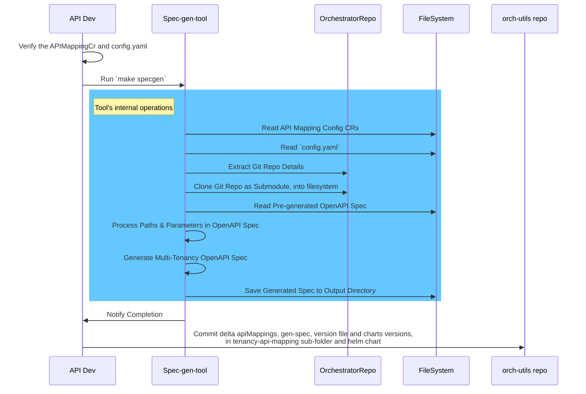

<!---
 Copyright (C) 2025 Intel Corporation

 Licensed under the Apache License, Version 2.0 (the "License");
 you may not use this file except in compliance with the License.
 You may obtain a copy of the License at
 
     http://www.apache.org/licenses/LICENSE-2.0
 
 Unless required by applicable law or agreed to in writing,
 software distributed under the License is distributed on an "AS IS" BASIS,
 WITHOUT WARRANTIES OR CONDITIONS OF ANY KIND, either express or implied.
 See the License for the specific language governing permissions
 and limitations under the License.
 
 SPDX-License-Identifier: Apache-2.0
-->

# Tenancy API Mapping

[](https://opensource.org/licenses/Apache-2.0)

## Overview

Tenancy API Mapping is a cloud native application on the Edge Orchestrator. It provides a URI rewrite scheme, that maps external facing URIs with internal representation of those corresponding APIs with following benefits:
  - Exposes a multi-tenant, hierarchical API to the external users, that is structured to compliant with industry standard API guidelines like Google AIP’s, AWS API etc.
  - Avoids the need for backend services to migrate the served APIs to roll this out to the user. Rather, the remapping feature provides a path where the user gets the benefit of the newer API right away, without requiring the backend to be changed as a pre-requisite.
  The APIs to be mapped are specified as configuration by the admin, at install/upgrade time, through API remapping K8s CRD. The expectation is that, these CR’s will only be created/updated at the time of install or upgrade. Otherwise these mappings are not expected to be changed at runtime.

## Get Started

Install Tenancy API Mapping.

```
helm install -n orch-iam --create-namespace charts/tenancy-api-remapping
```

Another way to try out Tenancy API Mapping is by using the Open Edge Platform Deployment.

## Develop

Tenancy API Mapping is developed in the **Go** language and is built as a Docker image, through a `Dockerfile` 
which is in `tenancy-api-mapping` folder. The CI integration for this repository will publish the container
image to the Edge Orchestrator Release Service OCI registry upon merge to the `main` branch.

Tenancy API Mapping has a corresponding Helm chart in `charts/tenancy-api-remapping` folder. The CI integration for 
this repository will publish this Helm charts to the Edge Orchestrator Release Service OCI registry upon 
merge to `main` branch. Tenancy API Mapping is deployed to the Edge Orchestrator using this Helm chart, 
whose lifecycle is in turn managed by Argo CD (see [Foundational Platform]).

Instructions on how to build, install and test.

### Prerequisites

This code requires the following tools to be installed on your development machine:

- [Go\* programming language](https://go.dev) - check [Makefile](./Makefile) on usage
- [golangci-lint](https://github.com/golangci/golangci-lint) - check [Makefile](./Makefile)  on usage
- [hadolint](https://github.com/hadolint/hadolint) - check [Makefile](./Makefile)  on usage
- [yamllint](https://github.com/adrienverge/yamllint) - check [Makefile](./Makefile)  on usage
- [reuse](https://github.com/fsfe/reuse-tool) - check [Makefile](./Makefile)  on usage
- Python\* programming language version 3.10 or later
- [gocover-cobertura](github.com/boumenot/gocover-cobertura) - check [Makefile](./Makefile)  on usage
- [Docker](https://docs.docker.com/engine/install/) to build containers
- [Helm](https://helm.sh/docs/intro/install/) for install helm charts for end-to-end tests

### Build, Scan and Test

The basic workflow to make changes to the code, verify those changes, and create a Github pull request (PR) is:

0. Edit and build the code with `make build` command

1. Run linters with `make lint` command

2. Run the unit tests with `make test` command

## Contribute

We welcome contributions from the community! To contribute, please open a pull request to have your changes reviewed
and merged into the main. We encourage you to add appropriate unit tests and e2e tests if your contribution introduces
a new feature. See the [CONTRIBUTING.md](../CONTRIBUTING.md) file for more information.

Additionally, ensure the following commands are successful:

```shell
make test
make lint
make license
make build
```
You can use `help` to see a list of makefile targets. The following is a list of makefile targets that support developer activities:

- `lint` run all linters run as in CI
- `license` lint licensing with the reuse tool
- `hadolint` lint Dockerfile with hadolint
- `go-lint` lint all go code with golangci-lint
- `yamllint` Lint all yaml files
- `test` Run go tests
- `coverage` Run Coverage
- `build` Runs build stage
- `all` Runs build, lint, test stages
- `release` to publish the built Tenancy API Mapping Docker container to pre-defined docker container registry. This registry is set in a env variable (TENANCY_API_MAPPING_DOCKER_IMAGE_OEP) in tenancy-api-mapping/Makefile

## Multi-Tenancy OpenAPI Specification Generator Tool Documentation

### Overview

The Multi-Tenancy OpenAPI Specification Generator is a tool designed to automate the generation of OpenAPI specifications for multi-tenant environments. It streamlines the process by reading API mapping configurations, cloning Git repositories as submodules, processing pre-generated OpenAPI specs, and producing new specs that accommodate multi-tenant architectures.

### Design Explanation

The tool functions by ingesting API mapping configuration resources (CRs) and a dedicated `config.yaml` file. It extracts Git repository details from the API mapping CRs for each module, retrieves the repository as a Git submodule, and accesses the pre-generated OpenAPI spec from the path specified in the CR. Subsequently, the tool processes each path in the OpenAPI spec in accordance with the mappings defined in the API mapping CR, culminating in the generation of a new OpenAPI spec designed for multi-tenancy.

### Flow Diagram

Below is a flow diagram illustrating how the tool works:



### API Mapping Config CR

The API Mapping Config CR (Custom Resource) is a Kubernetes resource that outlines the mappings and configurations essential for the generation of the multi-tenancy OpenAPI spec.

#### Fields in the API Mapping Config CR

##### Metadata

- `name`: The unique name of the API Mapping Config CR, used to identify the resource within a Kubernetes namespace.
- `labels`: This is the standard kubernetes labels field, a specific label mentioned-below needs to be added in each new API Mapping CR.

      `configs.config.edge-orchestrator.intel.com: default`

##### Spec

- `specGenEnabled`: A boolean indicating whether the generation of the OpenAPI spec is enabled.
- `repoConf`: Contains the Git repository configuration.
  - `url`: The URL of the Git repository containing the OpenAPI spec.
  - `tag`: The specific tag or branch to clone from the repository.
  - `specFilePath`: The relative file path to the OpenAPI spec within the repository.
- `mappings`: An array of mapping objects that correlate external URIs with service URIs.
  - `externalURI`: The new external URI to be used in the multi-tenancy OpenAPI spec.
  - `serviceURI`: The original service URI as defined in the pre-generated OpenAPI spec.
- `backend`: Specifies the backend service details where the API is hosted.
  - `service`: The Kubernetes service name.
  - `port`: The port on which the backend service is exposed.

### Tool's `config.yaml` Explanation

The `config.yaml` file specifies global settings for the tool:

- `localSubModsDir`: The directory for cloning Git submodules.
- `specOutputDir`: The directory where generated multi-tenancy OpenAPI specs are saved.
- `apimappingconfigcrsdir`: The directory containing the API mapping config CRs.
- `servers`: A list of server configurations to be included in the generated OpenAPI spec.

### Generating the Multi-Tenancy OpenAPI Spec

#### Step 1

##### Option A: Re-generate Using the Default Spec (base repo config and tag main)

1. Ensure the API mapping CRs is configured with required APIMapping.
2. Run the tool using `make specgen`.

For Example:

- Verify the mapping cr for 'metadata' service.
  ```
  ➜  foo@bar:~$ cat apimappingconfigcrs/amc-orch-metadata-broker-openapi.yaml

  apiVersion: apimappingconfig.edge-orchestrator.intel.com/v1
  kind: APIMappingConfig
  metadata:
    name: amc-orch-metadata-broker-openapi
    labels:
      configs.config.edge-orchestrator.intel.com: default
  spec:
    specGenEnabled: true
    repoConf:
      url: "https://github.com/open-edge-platform/orch-metadata-broker.git"
      tag: "v0.4.1"
      specFilePath: "api/spec/openapi.yaml"
    mappings:
      - externalURI: /v1/projects/{projectName}/metadata
        serviceURI: metadata.orchestrator.apis/v1/metadata
    backend:
      service: "metadata-broker-orch-metadata-broker-rest.orch-ui.svc.cluster.local"
      port: 9988
    ```

- run the spec gen tool.
  ```
  ➜  foo@bar:~$    make specgen

  === about to process openapi spec from repo : https://github.com/open-edge-platform/orch-metadata-broker.git, file : api/spec/openapi.yaml
  about to process 1 paths from the existing openapi spec

  key to check : metadata.orchestrator.apis/v1/metadata
  about to process operation GET
  about to process operation POST
  about to process operation DELETE
  number of paths after process = 1
  number of entries in mapping cr = 1
  === completed processing openapi spec from repo : https://github.com/open-edge-platform/orch-metadata-broker.git, file : api/spec/openapi.yaml
  Created Multi-tenancy OpenAPI spec for repo: https://github.com/open-edge-platform/orch-metadata-broker.git
  ```

##### Option B: Change the Tag and Re-generate

1. Edit the API Mapping Config CR to change the tag field under repoConf to the desired tag.
2. Run the tool using `make specgen`.

For Example:

- Update the tag.
  ```
    yq eval '.spec.repoConf.tag = "v0.3.1"' --inplace "apimappingconfigcrs/amc-orch-metadata-broker-openapi.yaml"
  ```
- verify the version
  ```
    ➜  foo@bar:~$ cat apimappingconfigcrs/amc-orch-metadata-broker-openapi.yaml
    apiVersion: apimappingconfig.edge-orchestrator.intel.com/v1
    kind: APIMappingConfig
    metadata:
      name: amc-orch-metadata-broker-openapi
      labels:
        configs.config.edge-orchestrator.intel.com: default
    spec:
      specGenEnabled: true
      repoConf:
        url: "https://github.com/open-edge-platform/orch-metadata-broker.git"
        tag: "v0.4.1"
        specFilePath: "api/spec/openapi.yaml"
      mappings:
        - externalURI: /v1/projects/{projectName}/metadata
          serviceURI: metadata.orchestrator.apis/v1/metadata
      backend:
        service: "metadata-broker-orch-metadata-broker-rest.orch-ui.svc.cluster.local"
        port: 9988

  ```

##### Note:

* On running the spec-generator command, all the specs will be processed.
  In order for other specs to be ignored, they have to be marked 'specGenEnabled: false' in the mapping cr.
  For Example:
    yq eval '.spec.specGenEnabled = false' --inplace "apimappingconfigcrs/<mapping-file-name>"

#### Step 2
##### Where to Expect the Result

The resulting multi-tenancy OpenAPI specs will be located in the `openapispecs/generated` directory as defined in the `config.yaml` file.

#### Step 3
##### Git Commit

Commit the following changes to the tool's Git repository:

1. The configured API mapping CRs.
2. The newly generated multi-tenancy OpenAPI specs.
3. The incremented version in the `VERSION` file.

#### Step 4
##### Propagating Changes to Orchestrated Deployment

To propagate the changes:

1. Update the relevant version in the `Chart.yaml` file in the 'orch-utils/tenancy-api-mapping' folder for 'tenancy-api-remapping'.
https://github.com/open-edge-platform/orch-utils/blob/7074ec3eae08861303b70d105de48e2c2cc717fd/charts/tenancy-api-remapping/Chart.yaml#L22
2. Increment the version for the 'orch-utils/tenancy-api-remapping' helm chart.
https://github.com/open-edge-platform/orch-utils/blob/7074ec3eae08861303b70d105de48e2c2cc717fd/charts/tenancy-api-remapping/Chart.yaml#L21

3. After merging, use this 'orch-utils/tenancy-api-remapping' chart version in the Open Edge Platform installation.

### Next Steps

For consumers of these OpenAPI specs:

1. Utilize the provided OpenAPI specs to generate the corresponding UI code.
2. Generate the appropriate tag for deployment.

This documentation offers a detailed guide for users to effectively leverage the Multi-Tenancy OpenAPI Specification Generator tool, covering all necessary steps from initial

### To Generate the Combined Open API Spec

`make gen-convert-combine-all`

This target generates the unified open API spec for all the service API specs and the Datamodel API spec.

The spec for the service APIs will get pulled from the configs provided in the `apimappingconfigcrs/` path.

Where as the Datamodel spec is coped directly from the repo. there is a provision to mentoin the tag version in the make file.
  `DM_REPO_TAG_VERSION` to specify the version of spec file to be copied.

## Community and Support

To learn more about the project, its community, and governance, visit the [Edge Orchestrator Community](https://github.com/open-edge-platform).
For support, start with [Troubleshooting](https://github.com/open-edge-platform) or [contact us](https://github.com/open-edge-platform).

## License

Tenancy API Mapping is licensed under Apache 2.0.
